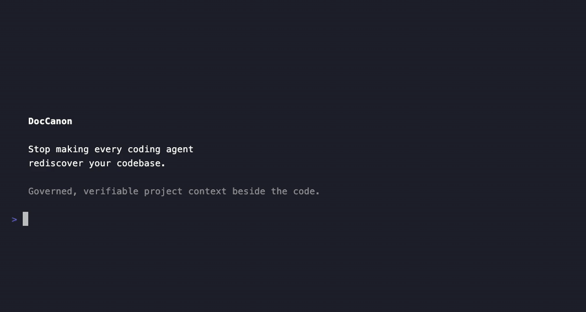

[English](README.md) | [简体中文](README.zh-CN.md)

# DocCanon

### Stop making every coding agent rediscover your codebase.



**DocCanon is a verified context layer for coding agents.**

It keeps a compact, trustworthy understanding of your project beside the code, so coding agents can reuse the same context instead of repeatedly scanning and re-interpreting the repository from scratch.

**Reuse context. Keep it fresh. Switch agents.**

---

## Quick Start

Install DocCanon into your current project:

```bash
gh skill install Heluhan/Doccanon doccanon --agent universal
```

Then tell your coding agent:

> **Set up DocCanon for this project.**

That's it.

Once configured, use your coding agent normally. DocCanon handles context routing, verification, and documentation synchronization as part of the workflow.

> `gh skill` is currently a GitHub CLI preview feature. For host-specific or manual installation, see [Installation](#installation).

---

## Why DocCanon?

### 1. Stop rediscovering the same codebase

A new task often starts with the same expensive routine:

```text
Task
  ↓
Search the repository
  ↓
Read entry points
  ↓
Trace dependencies
  ↓
Reconstruct architecture
  ↓
Find the relevant code
  ↓
Start working
```

Much of that understanding is durable. It should not have to be rebuilt for every task or every new agent session.

DocCanon gives the agent a compact project map first:

```text
Task
  ↓
Load relevant project context
  ↓
Inspect relevant code
  ↓
Start working
```

The agent still verifies the source code where needed.

It just does not have to treat the entire repository as unknown territory every time.

This is designed to reduce repeated repository exploration — and therefore the context, tool calls, and time spent getting oriented.

Actual token savings depend on the repository, task, model, and agent, so DocCanon does not claim a universal percentage.

---

### 2. Switch agents without losing project context

Your project's understanding should belong to the **project**, not to one model, IDE, or session.

DocCanon keeps canonical knowledge in plain Markdown beside the code:

```text
CONTEXT.md
docs/
```

Different coding agents can work from the same project understanding:

```text
Codex ──────────┐
Claude Code ────┤
Cursor ─────────┼──→ Project context ──→ Codebase
OpenCode ───────┤
Copilot ────────┤
Gemini CLI ─────┘
```

Use one agent today and another tomorrow without rebuilding the project's mental model from zero.

**Switch agents, not context.**

---

### 3. Don't let shared context silently go stale

Persistent context creates a new problem:

**What happens when the code changes but the documentation doesn't?**

A stale project map can be worse than no map at all.

DocCanon treats freshness as part of the system.

It checks whether canonical project knowledge is valid for the current branch, tracks which current-state owners are affected by implementation changes, and refuses to treat the project as synchronized while relevant changes remain unaccounted for.

```text
Code changes
     ↓
Affected project knowledge?
     ↓
   yes
     ↓
Update + verify
     ↓
Synchronized
```

So DocCanon is not just persistent context.

It is **governed, verifiable context**.

---

## How it works

For a governed project, the basic loop is:

1. **Check trust** — verify that canonical context is usable on the current branch.
2. **Route context** — load only the project knowledge relevant to the task.
3. **Verify code** — inspect the source, tests, configuration, or runtime evidence needed for the change.
4. **Implement** — make the actual code change.
5. **Keep context aligned** — update affected current-state knowledge and verify the result.

The user does not need to run this workflow manually.

The skill owns it.

```text
New task
   ↓
Verified context
   ↓
Relevant code
   ↓
Implementation
   ↓
Context update
   ↓
Verification
```

---

## Why not just use `AGENTS.md`, `CLAUDE.md`, or normal docs?

Those files are useful. DocCanon solves a different problem.

A normal project document can persist knowledge, but it can also silently become stale.

A tool-specific memory file can help one agent, but the knowledge may not travel cleanly to another.

And asking every agent to reconstruct the project directly from source works — but repeats the same exploration again and again.

DocCanon adds three things:

* **Portable context** — project knowledge lives with the repository.
* **Task routing** — agents load the smallest relevant context before inspecting code.
* **Verification** — reusable context is checked against the implementation instead of being trusted blindly.

DocCanon does **not** replace source-code inspection.

It changes where the agent starts.

> **Read the map first. Verify against the territory.**

---

## Try the failure mode

Want to see the trust boundary directly?

```bash
git clone https://github.com/Heluhan/Doccanon.git
cd Doccanon
python3 scripts/demo.py
```

The demo creates a disposable Git repository, establishes a governed baseline, changes covered code without updating its canonical owner, and shows DocCanon refusing to treat the stale state as synchronized.

---

## Installation

### GitHub CLI

For agents that use the shared project skill directory:

```bash
gh skill install Heluhan/Doccanon doccanon --agent universal
```

You can also install for a specific host:

```bash
# Codex
gh skill install Heluhan/Doccanon doccanon --agent codex

# Claude Code
gh skill install Heluhan/Doccanon doccanon --agent claude-code

# Cursor
gh skill install Heluhan/Doccanon doccanon --agent cursor

# OpenCode
gh skill install Heluhan/Doccanon doccanon --agent opencode
```

Preview the skill before installing:

```bash
gh skill preview Heluhan/Doccanon doccanon
```

### Manual install

DocCanon also ships with its own installer:

```bash
git clone https://github.com/Heluhan/Doccanon.git
cd Doccanon

python3 install.py \
  --agent universal \
  --scope project \
  --project /path/to/project
```

DocCanon has no runtime service, API key, vector database, or model dependency.

The helper requires **Git** and **Python 3.10+**.

See the full [agent compatibility matrix](docs/agent-compatibility.md) for host-specific placement and discovery details.

---

## Supported agents

DocCanon includes installation targets for:

* Codex
* Claude Code
* Cursor
* GitHub Copilot
* Gemini CLI
* OpenCode
* Cline

Host discovery and activation behavior varies. The canonical project knowledge itself remains local to the repository and portable across supported hosts.

---

## Token efficiency

DocCanon is designed around a simple idea:

> **Don't repeatedly spend context rediscovering knowledge the project already knows.**

Instead of broad repository exploration before every task, DocCanon routes the agent to a small, fresh canonical bundle followed by targeted code verification.

You can measure the context-volume mechanism locally:

```bash
python3 /path/to/doccanon/skills/doccanon/scripts/measure_context.py \
  --project . \
  --intent "change session recovery" \
  --baseline tracked-code \
  --json
```

This is a context-reduction proxy, not observed model token usage or cost.

For controlled measurements, see the [token benchmark protocol](skills/doccanon/references/token-benchmark.md).

---

## What DocCanon is not

DocCanon is not a replacement for source code, a vector database, or a codebase RAG service.

Code, tests, schemas, configuration, and direct runtime evidence remain the final proof of implementation behavior.

DocCanon gives agents a better starting point — and keeps that starting point accountable to the code.

---

## Learn more

* [简体中文 README](README.zh-CN.md)
* [Agent compatibility](docs/agent-compatibility.md)
* [DocCanon skill specification](skills/doccanon/SKILL.md)
* [Token benchmark protocol](skills/doccanon/references/token-benchmark.md)
* [Contributing](CONTRIBUTING.md)
* [Security](SECURITY.md)

---

## License

MIT.

---

**DocCanon turns codebase understanding from something every agent repeatedly reconstructs into something the project can preserve, verify, and reuse.**
